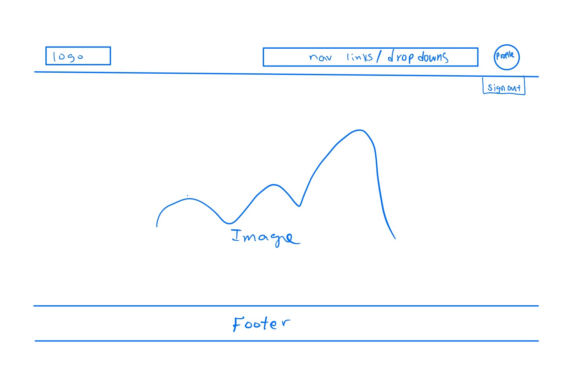
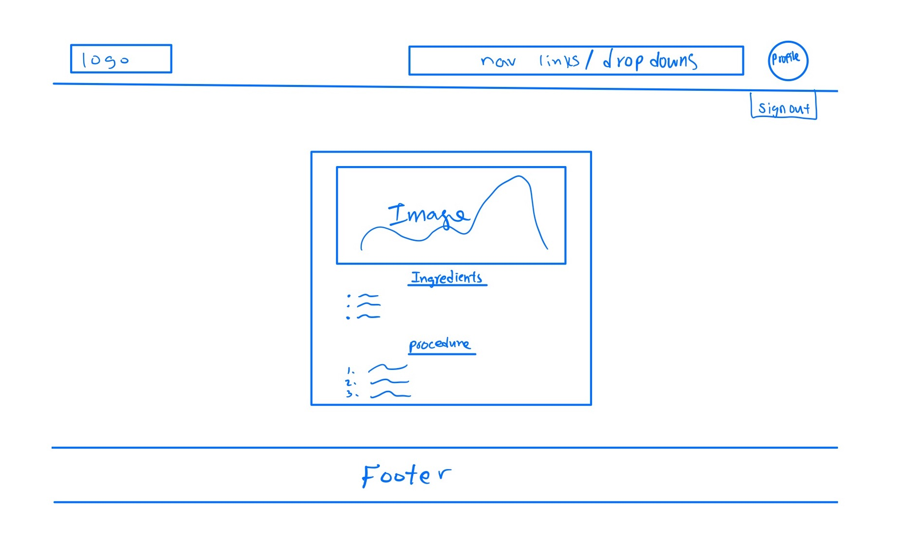

# Taste Technologists

## Table of contents

* [Overview](#overview)
* [Team](#team)
* [Team Contract](#team-contract)
* [User Guide](#user-guide)
* [Developer Guide](#developer-guide)

## Overview

The problem: Many college students have limited kitchen resources, limited cooking skills, limited time, limited access to grocery stores, and no access to creative recipes that respect these constraints. As a result, college students spend money to eat out, or eat non-healthy foods at fast food places or through vending machines.

The solution: Taste Technologists creates a way for students (on-campus or off) to learn and share recipes that:
* Can be made using minimal kitchen facilities (at a minimum, a toaster oven).
* Can be made out of ingredients that are available within walking distance of UH.
* Suit local taste sensibilities.
* Can be filtered via dietary restrictions (gluten-free, vegan, etc).
* Have an estimated cost per serving.
* Has an estimated number of servings per recipe.
* Has an estimate of how long it takes to make.

The project illustrates various technologies useful to ICS software engineering students, including:
* [Meteor](https://www.meteor.com/) for Javascript-based implementation of client and server code.
* [React](https://reactjs.org/) for component-based UI implementation and routing.
* [React Bootstrap](https://react-bootstrap.github.io/) CSS Framework for UI design.

It also provides code that implements a variety of useful design concepts, including:

* Three primary collections (Profiles, Recipes, Interests) as well as three "join" Collections (ProfilesInterests, ProfilesRecipe, and ProjectsInterests) that implement many-to-many relationships between them.

## Team
Our team consists of five developers: Amanda Achiu, Iwalani Campbell, Christina Mende, Tsz Ching Wong, and Christianne Young.

## Team Contract
In order to efficiently work together as a group, we have come with a [team contract](https://docs.google.com/document/d/1sjqEOUAvMnTnnFC-cFGRXGMhvwe6CVLrR_du6l2pfGI/edit?usp=sharing).

## User Guide

This section provides a walkthrough of the Taste Technologists user interface and its capabilities.

### Landing Page

The landing page is presented to users when they visit the top-level URL to the site.

### Search Recipe Page 

### Individual Recipe Page

### Sign in and sign up

Click on the "Login" button in the upper right corner of the navbar, then select "Sign in" to go to the following page and login. You must have been previously registered with the system to use this option:

Alternatively, you can select "Sign up" to go to the following page and register as a new user:

### Home page

After logging in, you are taken to the home page, which presents a form where you can complete and/or update your personal profile:

### Add Project page

Once you are logged in, you can define new projects with the Add Project page:

### Filter page

The Filter page provides the ability to query the database and display the results in the page. In this case, the query displays all of the Profiles that match one or more of the specified Interest(s).

## Developer Guide

As our team implements this application, we will be working according to three milestones.

Milestone 1 is located [here](https://github.com/orgs/taste-technologists/projects/1).

