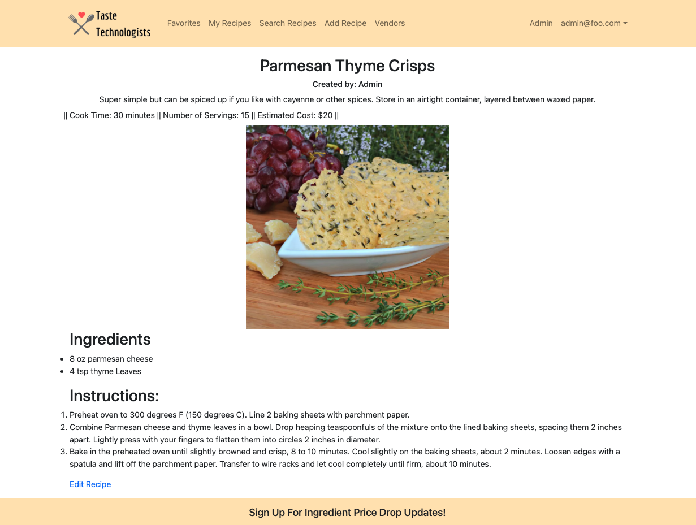
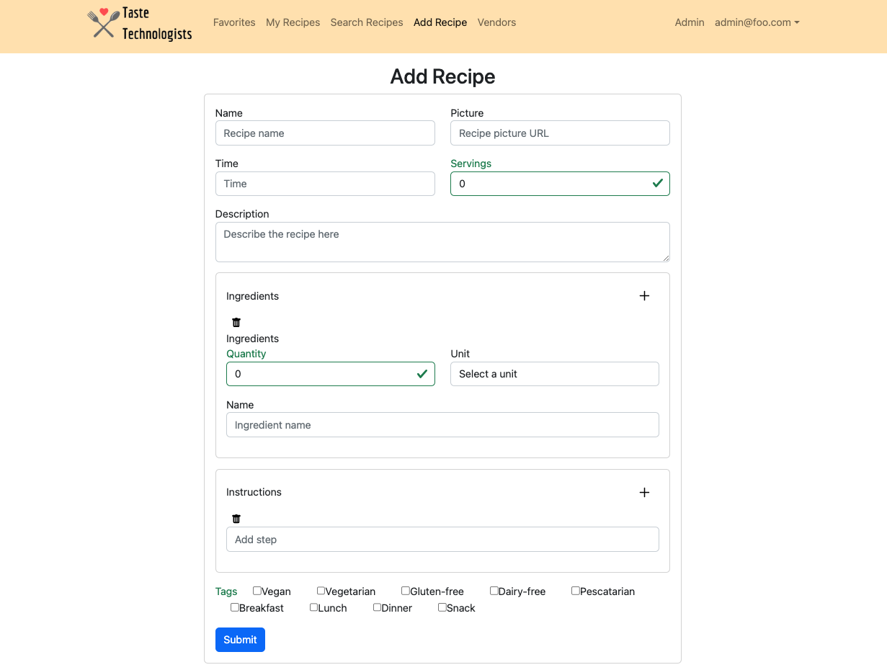
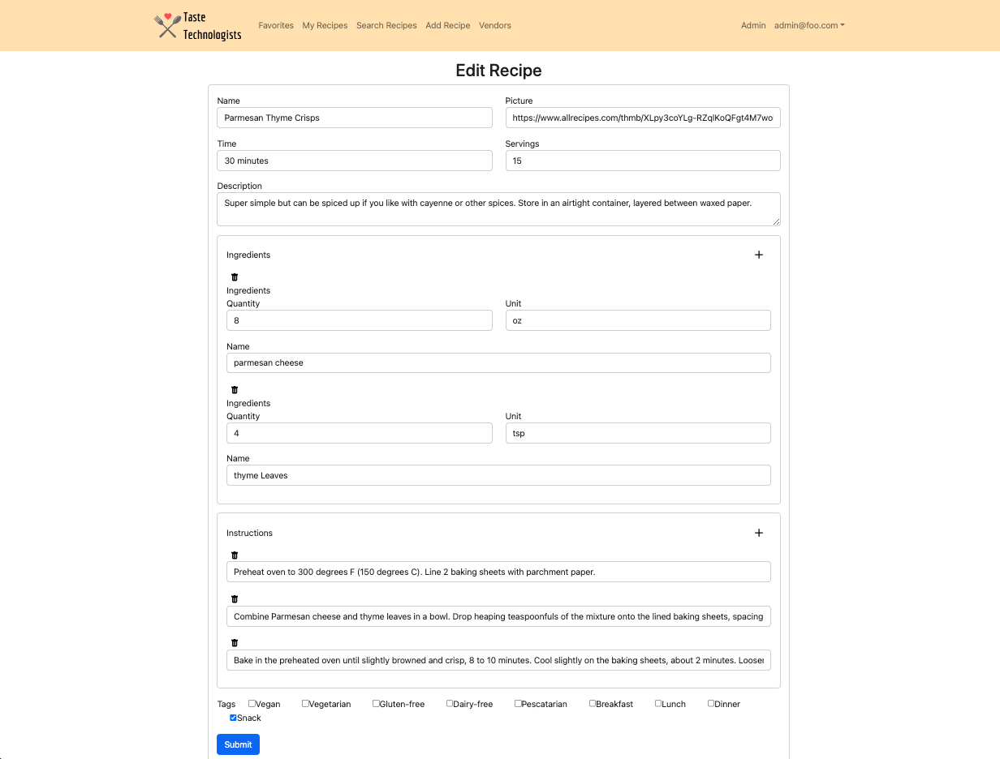
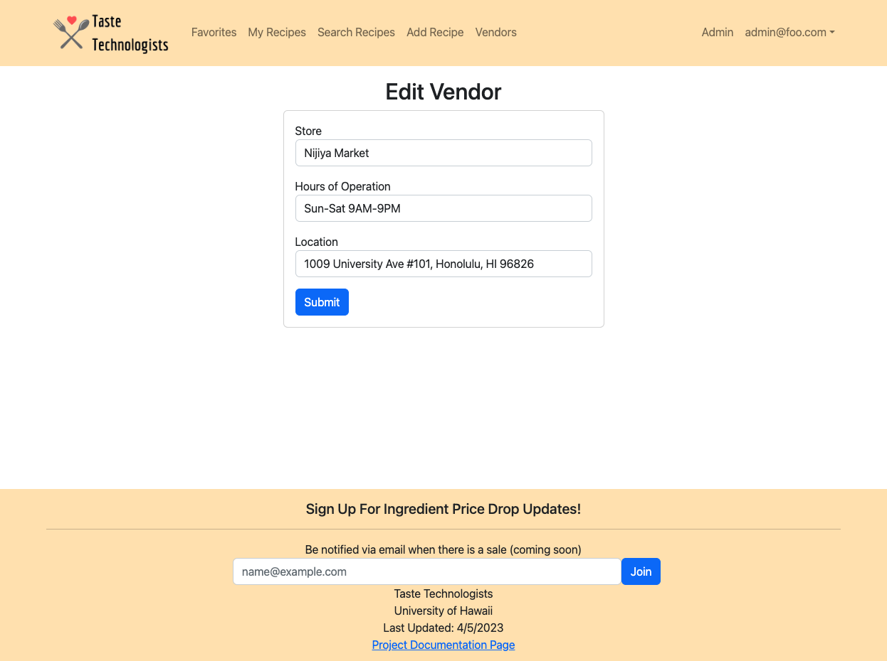
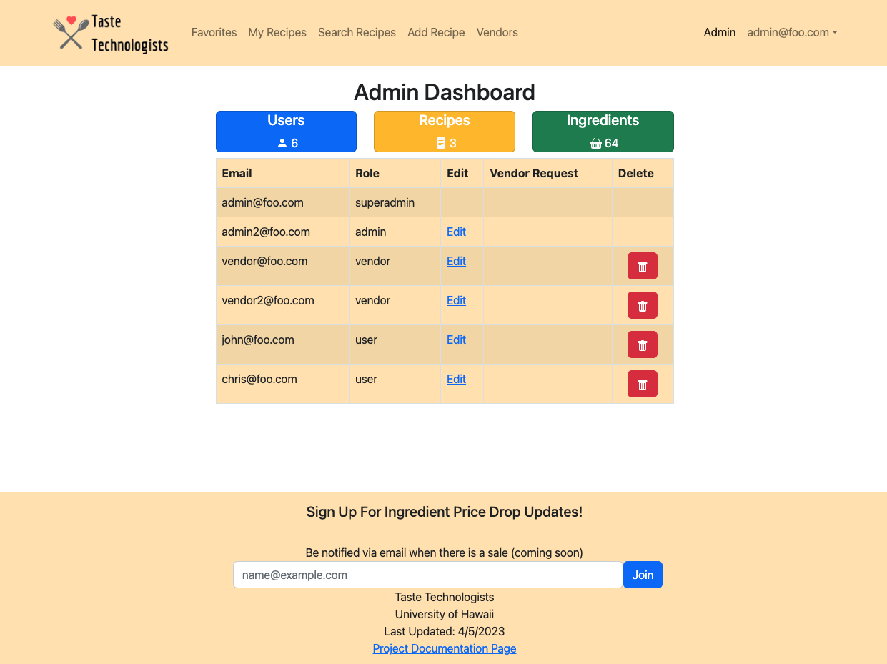

## Table of contents

* [Overview](#overview)
* [User Guide](#user-guide)
* [Developer Guide](#developer-guide)
* [Development History](#development-history)
* [Deployment](#deployment)
* [Contact Us](#contact-us)
* [Team](#team)
* [Team Contract](#team-contract)

## Overview

[Taste Technologists](https://github.com/taste-technologists) is a web application designed for college students with limited kitchen resources, minimal cooking skills, and limited access to groceries. Our application is for college students who would like to eat healthier and spend less money on eating out. This application is based on [Toaster Oven Lovin'](https://courses.ics.hawaii.edu/ics314s23/morea/final-project/reading-project-toaster-oven-lovin.html).

Taste Technologists gives students (on-campus or off) a variety of easy and delicious recipes that:
* Can be made using minimal kitchen facilities (at a minimum, a toaster oven).
* Can be made out of ingredients that are available within walking distance of UH.
* Suit local taste sensibilities.
* Can be filtered via dietary restrictions (gluten-free, vegan, etc).
* Have an estimated cost per serving.
* Has an estimated number of servings per recipe.
* Has an estimate of how long it takes to make.


The project illustrates various technologies useful to ICS software engineering students, including:
* [Meteor](https://www.meteor.com/) for Javascript-based implementation of client and server code.
* [React](https://reactjs.org/) for component-based UI implementation and routing.
* [React Bootstrap](https://react-bootstrap.github.io/) CSS Framework for UI design.

It also provides code that implements a variety of useful design concepts, including:

* Vendor, admin and default users (students).  Admins can edit all content in the system, remove inappropriate content and establish users having a vendor role. Vendors can establish a profile including their locations and hours and for each ingredient in the system indicate the stock, cost, and quantity. Regular users can also change ingredient price and availability.  From ingredient information the system can automatically calculate all the places nearby campus that has the ingredient and the prices for each ingredient at each place. 


## User Guide

This section provides a walkthrough of the Taste Technologists user interface and its capabilities.

### Landing Page

The landing page is presented to users when they visit the top-level URL to the site.


### Sign In and Sign Up Page

Click on the "Login" button in the upper right corner of the navbar, then select "Sign in" to go to the following page and login. You must have been previously registered with the system to use this option:


Alternatively, you can select "Sign up" to go to the following page and register as a new user:


### Favorites Page

The list recipes page provides a display of all the recipe cards in the database. 


### Search Page

The search page provides the ability to filter the recipe database and display the results in the page. 


### Individual Recipe Page

The individual recipe page provides the necessary information of the selected recipe. The recipe card should include but not limited to:

* Minimal kitchen facilities 
* Dietary restrictions 
* Cost, servings, time
* Available ingredients 
* Nearby grocery stores



### My Recipes Page
The my recipes page will display all of the recipes that the user has added to the application. Here they can access the edit link to edit their own recipes.


### Add Recipes Page
The add recipes page gives users the ability to add their own recipes to the application. Each time a recipe is added by a user, the user's email will be set as the recipe's owner.



### Edit Recipes Page
The edit recipes page gives users the ability to edit their own recipes in the application.



### Vendor Page

The vendor page lists all of the available stores, locations, hours, and the updated inventory. If a user is assigned to the vendor role, they will be able to edit the inventory for their store.


### Vendor Add Page
*** Add Description ***


### Vendor Edit Page
*** Add Description ***



### Vendor Inventory Page
*** Add Description ***


### Add Inventory Page
*** Add Description ***


### Edit Inventory Page
*** Add Description ***


### Admin Dashboard Page
*** Add Description ***




### Admin Edit Role Page
*** Add Description ***


### Admin Vendor List Page
*** Add Description ***


## Developer Guide


<h3>Installation</h3>
<details>
<summary>Click for installation instructions </summary>

<p>First, <a href="https://meteor.com/install"> install Meteor</a></p>

<p>Second, go to <a href="https://github.com/taste-technologists/taste-technologists">https://github.com/taste-technologists/taste-technologists</a>, and download a copy of Taste Technologists.</p>

<p>Third, go to your newly created repository, and click the "Clone or download" button to download your new GitHub repo to your local file system.  Using <a href="https://desktop.github.com/">Github Desktop</a> is a great choice if you use MacOS or Windows.</p>

<p>Fourth, cd into the app/ directory of your local copy of the repo, and install third party libraries with:</p>

<pre>
<code> $ meteor npm install </code>
</pre>
</details>

<h3>Running the system</h3>

<details>
<summary>Click for instructions on running the system.</summary>

<p>Once the libraries are installed, you can run the application by invoking the "start" script in the <a href="https://github.com/taste-technologists/taste-technologists/blob/main/app/package.json">package.json file</a>:</p>

<code>
$ meteor npm run start
</code>

<p>The first time you run the app, it will create some default users and recipes. Here is the output of the current version:</p>
<pre>
<code>
$ meteor npm run start

> meteor-application-template-react@ start /Users/user/Documents/GitHub/taste-technologists/app
> meteor --no-release-check --exclude-archs web.browser.legacy,web.cordova --settings ../config/settings.development.json

[[[[[ ~/Documents/GitHub/taste-technologists/app ]]]]]

=> Started proxy.                             
=> Started HMR server.                        
=> Started MongoDB.                           
I20230412-14:08:22.799(-10)? Creating the default user(s)
I20230412-14:08:22.812(-10)?   Creating user admin@foo.com.
I20230412-14:08:22.917(-10)?   Creating user vendor@foo.com.
I20230412-14:08:23.007(-10)?   Creating user john@foo.com.
I20230412-14:08:23.200(-10)? Creating default recipes.
I20230412-14:08:23.201(-10)?   Adding: Feta-Spinach Puff Pastry Bites (john@foo.com)
I20230412-14:08:23.317(-10)?   Adding: Parmesan Thyme Crisps (admin@foo.com)
=> Started your app.

=> App running at: http://localhost:3000/
       
</code>
</pre>

Periodically, you might see
<code> Error starting Mongo (2 tries left): Cannot run replSetReconfig because the node is currently updating its configuration
</code>

after the <code>=> Started HMR server.</code>. It doesn't seem to be a problem since the MongoDB does start.

</details>

### Viewing the running app


If all goes well, the template application will appear at [http://localhost:3000](http://localhost:3000).  You can login using the credentials in [settings.development.json](https://github.com/taste-technologists/taste-technologists/blob/main/config/settings.development.json), or else register a new account.

### ESLint

You can verify that the code obeys our coding standards by running ESLint over the code in the imports/ directory with:

```
meteor npm run lint
```


## Deployment

### Digital Ocean Setup
For our project, we used [Digital Ocean](https://www.digitalocean.com/) to set up the server and host the application.

To Deploy Taste Technologists, you will need to complete several steps:

<details>
<summary>Click for Deployment Instructions</summary>

<h4>1. Sign up with Digital Ocean</h4>
<p>Go to <a href="https://www.digitalocean.com/">Digital Ocean</a> and click on the 'Sign Up' button to create your account.</p>
<p>Note that you will need a credit card to complete the sign up. Currently (as of 4/12/23) Digital Ocean is offering a free $200 credit for 60 days.</p>

<h4>2. Create an Ubuntu Server</h4>
<p>Find the Create Droplets page and choose your preferred settings. Once you are finished selecting your settings, click the 'Create Droplet' button at the bottom of your screen.</p>
<p>The following are some recommended settings:</p>
<details>
<summary>Click to view</summary>

<ul>
<li>Ubuntu Server - Version 22.10 x64</li>
<li>Droplet Type - Shared CPU - Basic</li>
</ul>

<ul>
<li>CPU options - Regular - Disk type: SSD</li>
<li>Plan - $6/mo with 1GB/1CPU - 25GB SSD Disk - 1000 GB transfer</li>
</ul>

<ul>
<li>Authentication Method - Create a root password</li>
</ul>
</details>
<p>Once you have successfully created your droplet, you will find the information under your first project.</p>


<h4>Local Setup</h4>
<p>The rest of the deployment instructions must be carried out via your computer.</p>

<h4>3. Clone and install a copy of Taste Technologists.</h4>
If you have not already done so, clone the repository for Taste Technologists and run the installation instructions.

<h4>4. Install Meteor Up</h4>
<p>Install Meteor Up onto your computer by running</p>

<code>$ npm install --global mup</code>

<h4>5. Create app/.deploy/mup.js and app/.deploy/settings.json</h4>

<p>Create an IntelliJ Project for your local copy of Taste Technologists.</p>

<p>In the app/.deploy directory, you’ll find two files: mup.sample.js and settings.sample.json. Make a copy of mup.sample.js called mup.js, and a copy of settings.sample.json called settings.json. When you’re done, the .deploy directory should look like this:</p>


<p>These files should be git-ignored, so you may safely store credentials here.</p>

<h4>6. Configure mup.js</h4>
<p>To do the initial deployment, you only need to edit the mup.js starting template.</p>
<details>
<summary>Click to view code: </summary>

<pre>
<code>
module.exports = {
  servers: {
    one: {
      host: '111.222.333.444',
      username: 'root',
      password: 'changeme'
    }
  },

  app: {
    name: 'meteor-application-template-react',
    path: '../',

    servers: {
      one: {},
    },

    buildOptions: {
      serverOnly: true,
    },

    env: {
      ROOT_URL: 'http://111.222.333.444',
      MONGO_URL: 'mongodb://mongodb/meteor',
      MONGO_OPLOG_URL: 'mongodb://mongodb/local',
    },

    docker: {
      image: 'zodern/meteor:latest',
    },

    enableUploadProgressBar: true
  },

  mongo: {
    version: '5.0.5',
    servers: {
      one: {}
    }
  },
};
</code>
</pre>
</details>

<p>There is one occurrence of the string “changeme”, and two occurrences of the string “111.222.333.444”.</p>
<p>Change the string “changeme” (i.e. the server root password) to the Droplet root password you specified earlier.</p>
<p>Change the string “111.222.333.444” to the IP address associated with your Droplet. Be sure to use the “ipv4” address, not the “Private IP” address!</p>
<p>Note that the “host” value is just the IP address, but the ROOT_URL is “http://” followed by the IP address.</p>

<h4>7. Run mup setup</h4>
<p>Once you have completed configuring the mup.js file, you can now setup the application and MongoDB database.</p>

<p>Inside the app/.deploy directory, invoke “mup setup” (or “mup.cmd setup” on Windows).</p>

<pre>
<code>
$ mup setup 

Started TaskList: Setup Docker
[111.222.333.444] - Setup Docker
[111.222.333.444] - Setup Docker: SUCCESS

Started TaskList: Setup Meteor
[111.222.333.444] - Setup Environment
[111.222.333.444] - Setup Environment: SUCCESS

Started TaskList: Setup Mongo
[111.222.333.444] - Setup Environment
[111.222.333.444] - Setup Environment: SUCCESS
[111.222.333.444] - Copying Mongo Config
[111.222.333.444] - Copying Mongo Config: SUCCESS

Started TaskList: Start Mongo
[111.222.333.444] - Start Mongo
[111.222.333.444] - Start Mongo: SUCCESS

Next, you should run:
    mup deploy
</code>
</pre>

<h4>8. Run mup deploy</h4>
<p>If the previous step was successful, you can now start running your application on the Droplet.</p>
<p>Inside the same directory as before (app/.deploy), invoke "mup deploy" (or, on Windows “mup.cmd deploy”).</p>

<pre>
<code>
$ mup deploy
Building App Bundle Locally

Started TaskList: Pushing Meteor App
[111.222.333.444] - Pushing Meteor App Bundle to the Server
[111.222.333.444] - Pushing Meteor App Bundle to the Server: SUCCESS
[111.222.333.444] - Prepare Bundle
[111.222.333.444] - Prepare Bundle: SUCCESS

Started TaskList: Configuring App
[111.222.333.444] - Pushing the Startup Script
[111.222.333.444] - Pushing the Startup Script: SUCCESS
[111.222.333.444] - Sending Environment Variables
[111.222.333.444] - Sending Environment Variables: SUCCESS

Started TaskList: Start Meteor
[111.222.333.444] - Start Meteor
[111.222.333.444] - Start Meteor: SUCCESS
[111.222.333.444] - Verifying Deployment
[111.222.333.444] - Verifying Deployment: SUCCESS
</code>
</pre>

<h4>9. View your application</h4>
The Taste Technologists application should now be available at at http://111.222.333.444, where '111.222.333.444' is replaced by the IP address for your Droplet.

</details>

## Development History
As our team implements this application, we will be working according to three milestones.  For our first deployment our main concerns were creating the base pages and basic components of the page.  We used the react template to give us the framework of the website. Additionally, we added in basic user functionality like being able to see all recipes and individual recipes.  We also created logos and have a draft of a basic theme.  In the M2 we want to create more collections as well as functionality for users, vendors and admins.  Depending on how much tasks we finish in M2 we could also create beyond the basics features.  

[Milestone 1](https://github.com/orgs/taste-technologists/projects/1)

[Milestone 2](https://github.com/orgs/taste-technologists/projects/7)

[Milestone 3](https://github.com/orgs/taste-technologists/projects/8)


## Deployment
The deployed application can be viewed [here](https://taste-technologist.site).

## Contact Us

### Team
Our team consists of five developers: [Amanda Achiu](https://blesssyouu.github.io/), [Iwalani Campbell](https://iwalanicampbell.github.io/), [Christina Mende](https://mendechris.github.io/), [Tsz Ching Wong](https://twong9.github.io/), and [Christianne Young](https://clyyoung.github.io/).

If you have any questions or comments about Taste Technologists, you may find the contact information for our team members by clicking a link above.

Coordination strategy:
* One meeting in person, one virtually via Discord
* Short meetings on Discord if needed
* Issues will be self-assigned

### Team Contract
In order to efficiently work together as a group, we have come up with a [team contract](https://docs.google.com/document/d/1sjqEOUAvMnTnnFC-cFGRXGMhvwe6CVLrR_du6l2pfGI/edit?usp=sharing). 
