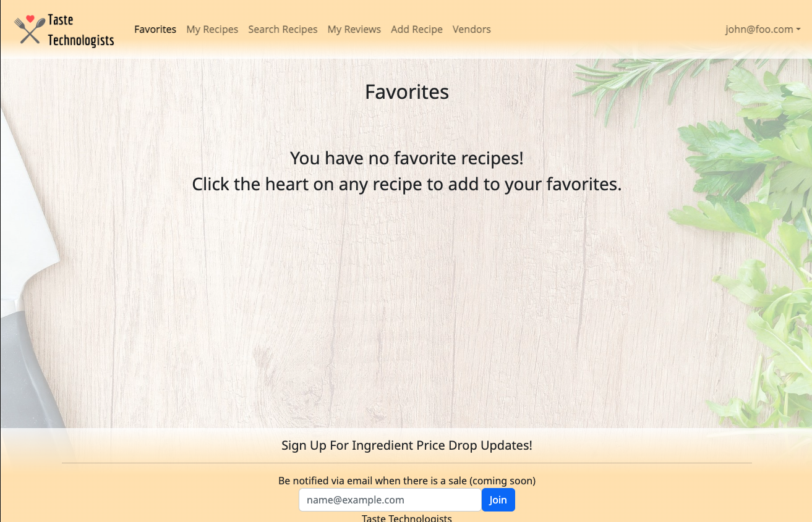
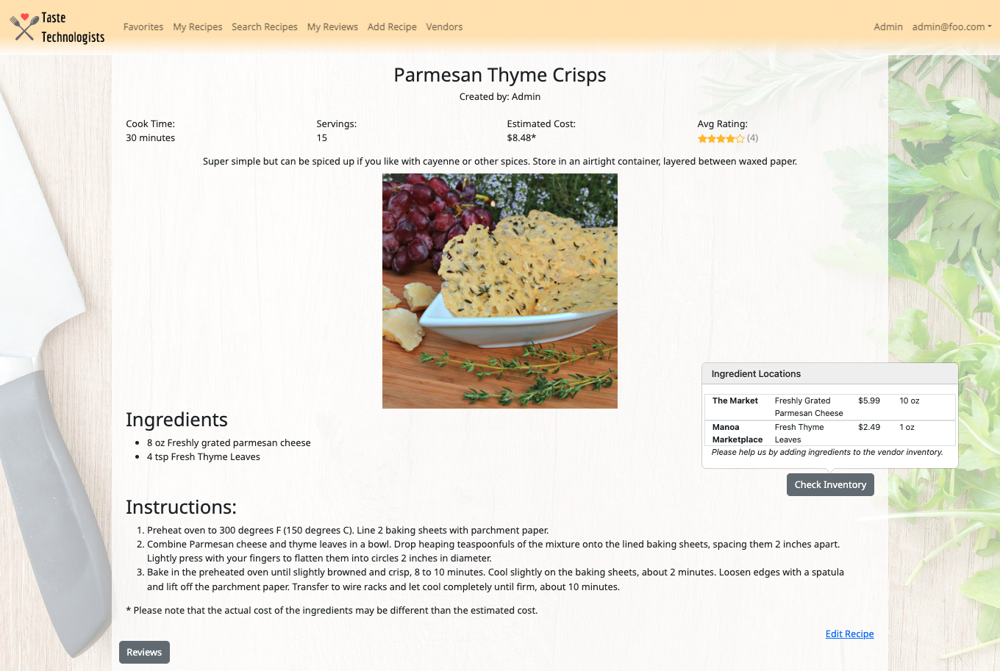
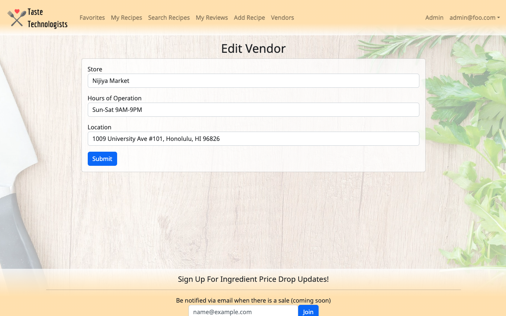

[](https://github.com/taste-technologists/taste-technologists/actions)

## Table of contents

* [Overview](#overview)
* [User Guide](#user-guide)
* [Developer Guide](#developer-guide)
* [Deployment](#deployment)
* [Development History](#development-history)
* [Deployed App](#deployed-app)
* [Community Feedback](#community-feedback)
* [Contact Us](#contact-us)
* [Team](#team)
* [Team Contract](#team-contract)

## Overview

[Taste Technologists](https://github.com/taste-technologists) is a web application designed for college students with limited kitchen resources, minimal cooking skills, and limited access to groceries. Our application is for college students who would like to eat healthier and spend less money on eating out. This application is based on [Toaster Oven Lovin'](https://courses.ics.hawaii.edu/ics314s23/morea/final-project/reading-project-toaster-oven-lovin.html).

Taste Technologists gives students (on-campus or off) a variety of easy and delicious recipes that:
* Can be made using minimal kitchen facilities (at a minimum, a toaster oven).
* Can be made out of ingredients that are available within walking distance of UH.
* Suit local taste sensibilities.
* Can be filtered via dietary restrictions (gluten-free, vegan, etc).
* Have an estimated cost per serving.
* Has an estimated number of servings per recipe.
* Has an estimate of how long it takes to make.


The project illustrates various technologies useful to ICS software engineering students, including:
* [Meteor](https://www.meteor.com/) for Javascript-based implementation of client and server code.
* [React](https://reactjs.org/) for component-based UI implementation and routing.
* [React Bootstrap](https://react-bootstrap.github.io/) CSS Framework for UI design.

It also provides code that implements a variety of useful design concepts, including: 

* Vendor, admin and default users (students).  Admins can edit all content in the system, remove inappropriate content and establish users having a vendor role. Vendors can establish a profile including their locations and hours and for each ingredient in the system indicate the stock, cost, and quantity. Regular users can also change ingredient price and availability.  From ingredient information the system can automatically calculate all the places nearby campus that has the ingredient and the prices for each ingredient at each place. 


## User Guide

This section provides a walkthrough of the Taste Technologists user interface and its capabilities.

### Landing Page

The landing page is presented to users when they visit the top-level URL to the site.


### Sign In and Sign Up Page

Click on the "Login" button in the upper right corner of the navbar, then select "Sign in" to go to the following page and login. You must have been previously registered with the system to use this option:


Alternatively, you can select "Sign up" to go to the following page and register as a new user:


### Favorites Page

The list recipes page provides a display of all the recipe cards in the database. 


If a user has not yet added any favorites the following page will be displayed:


### Search Page

The search page provides the ability to filter the recipe database and display the results in the page. 


### Individual Recipe Page

The individual recipe page provides the necessary information of the selected recipe. The recipe card may include information such as:

* Ingredients and Instructions 
* Average User Rating
* Cost, servings, time
* Available ingredients 
* Nearby grocery stores

This is the initial view of an individual recipe page: 


Users can select the "Check Inventory" button to see the availability of a recipe's ingredients.


Clicking the "Reviews" button brings up a panel with users' ratings and reviews of the recipe. There is also a form for users to add their own rating and review.


### My Recipes Page
The my recipes page will display all of the recipes that the user has added to the application. Here they can access the edit link to edit their own recipes. Users can also delete their own recipes.


If a user has not added any recipes they will see the following page:


### My Reviews Page
The My Reviews Page will display all of the reviews that the user has added to the application. Here they can read their past reviews and delete them.


If a user has not added any reviews they will see the following page:


### Add Recipe Page
The add recipe page gives users the ability to add their own recipes to the application. Each time a recipe is added by a user, the user's email will be set as the recipe's owner.


### Edit Recipe Page
The edit recipe page gives users the ability to edit their own recipes in the application.


### Vendor Page

The vendor page lists all of the available stores, locations, hours, and the updated inventory. If a user is assigned to the vendor role, they will be able to add and edit vendors. Users can click on the vendor's address to open it in Google Maps.


Admin users have the ability to add, edit, and delete vendors.


Regular users will see the following vendor page:


### Add Vendor Page
The add vendor page allows a user to create a new vendor for the application's vendor list. The only users with this functionality are the superadmin, admin, and vendor.


### Edit Vendor Page
The edit vendor page allows an authorized user to edit the vendor information so that it is up-to-date.


### Vendor Inventory Page
The vendor inventory page allows all users to view the current inventory and add and edit items for the vendor. Clicking the shopping cart icon takes users to the Add Inventory page. Clicking the address takes users to the address location on Google Maps.


Users with Admin or Vendor roles also have the ability to delete items from the inventory.


### Add Inventory Page
The add inventory page allows all users to add an item to a vendor's inventory. The form is autofilled with the vendor's name.


### Edit Inventory Page
The edit inventory page allows all users to edit an item's information. The form is autofilled with the vendor's name and the name is un-editable.


### Admin Dashboard Page
The admin dashboard pages allows an admin user to view all of the users in the application along with their respective role. Admins can also see a total user count, recipe count, and vendor count. The recipes button goes to the search recipes page and the ingredients button goes to the admin vendor list page. If a user requests to be a vendor, this will appear on the dashboard as well. Additionally, admins can delete users from the application. In order to create a safeguard for admin users, only the superadmin can delete admin users.


### Admin Edit Role Page
Clicking on the edit button on the admin dashboard leads the admin to the edit role page. Here admins can update and change the roles of users on the application. If a user requests to be a vendor, the admin can grant this request through this page.

Note that only a superadmin can assign an admin role to other users.


### Admin Recipe List Page
The admin recipe list page allows the admin user to view all of the recipes in the application. Admin can also edit and delete any recipe from this page.


### Admin Vendor Inventory Page
The admin vendor inventory page allows the admin user to view all of the vendors as well as the inventory that they have in stock. Admins can also edit and delete the items in the inventory.

Note that the edit link takes the admin to the same edit inventory page as above.


### Admin Reviews Page
The admin reviews page allows the admin user to view all of the reviews for all recipes in the app. Admins can also delete the reviews from the app on this page.


### Admin Review Generator
For testing purposes, there is a page that will generate random reviews and also delete every single review. The link to this is hidden on the admin panel.


## Developer Guide


<h3>Installation</h3>
<details>
<summary style="color:blue;">Click for installation instructions </summary>

<p>First, <a href="https://meteor.com/install"> install Meteor</a></p>

<p>Second, go to <a href="https://github.com/taste-technologists/taste-technologists">https://github.com/taste-technologists/taste-technologists</a>, and download a copy of Taste Technologists.</p>

<p>Third, go to your newly created repository, and click the "Clone or download" button to download your new GitHub repo to your local file system.  Using <a href="https://desktop.github.com/">Github Desktop</a> is a great choice if you use MacOS or Windows.</p>

<p>Fourth, cd into the app/ directory of your local copy of the repo, and install third party libraries with:</p>

<pre>
<code> $ meteor npm install </code>
</pre>
</details>

<h3>Running the system</h3>

<details>
<summary style="color:blue;">Click for instructions on running the system.</summary>

<p>Once the libraries are installed, you can run the application by invoking the "start" script in the <a href="https://github.com/taste-technologists/taste-technologists/blob/main/app/package.json">package.json file</a>:</p>

<code>
$ meteor npm run start
</code>

<p>The first time you run the app, it will create some default users and recipes. Here is the output of the current version:</p>
<pre>
<code>
$ meteor npm run start

> meteor-application-template-react@ start /Users/user/Documents/GitHub/taste-technologists/app
> meteor --no-release-check --exclude-archs web.browser.legacy,web.cordova --settings ../config/settings.development.json

[[[[[ ~/Documents/GitHub/taste-technologists/app ]]]]]

=> Started proxy.                             
=> Started HMR server.                        
=> Started MongoDB.                           
I20230412-14:08:22.799(-10)? Creating the default user(s)
I20230412-14:08:22.812(-10)?   Creating user admin@foo.com.
I20230412-14:08:22.917(-10)?   Creating user vendor@foo.com.
I20230412-14:08:23.007(-10)?   Creating user john@foo.com.
I20230412-14:08:23.200(-10)? Creating default recipes.
I20230412-14:08:23.201(-10)?   Adding: Feta-Spinach Puff Pastry Bites (john@foo.com)
I20230412-14:08:23.317(-10)?   Adding: Parmesan Thyme Crisps (admin@foo.com)
=> Started your app.

=> App running at: http://localhost:3000/
       
</code>
</pre>

Periodically, you might see
<code> Error starting Mongo (2 tries left): Cannot run replSetReconfig because the node is currently updating its configuration
</code>

after the <code>=> Started HMR server.</code>. It doesn't seem to be a problem since the MongoDB does start.

</details>

### Viewing the running app


If all goes well, the template application will appear at [http://localhost:3000](http://localhost:3000).  You can login using the credentials in [settings.development.json](https://github.com/taste-technologists/taste-technologists/blob/main/config/settings.development.json), or else register a new account.

### ESLint

You can verify that the code obeys our coding standards by running ESLint over the code in the imports/ directory with:

```
meteor npm run lint
```


## Deployment

### Digital Ocean Setup
For our project, we used [Digital Ocean](https://www.digitalocean.com/) to set up the server and host the application.

To Deploy Taste Technologists, you will need to complete several steps:

<details>
<summary style="color:blue;">Click for Deployment Instructions</summary>

<h4>1. Sign up with Digital Ocean</h4>
<p>Go to <a href="https://www.digitalocean.com/">Digital Ocean</a> and click on the 'Sign Up' button to create your account.</p>
<p>Note that you will need a credit card to complete the sign up. Currently (as of 4/12/23) Digital Ocean is offering a free $200 credit for 60 days.</p>

<h4>2. Create an Ubuntu Server</h4>
<p>Find the Create Droplets page and choose your preferred settings. Once you are finished selecting your settings, click the 'Create Droplet' button at the bottom of your screen.</p>
<p>The following are some recommended settings:</p>
<details>
<summary style="color:blue;">Click to view</summary>

<ul>
<li>Ubuntu Server - Version 22.10 x64</li>
<li>Droplet Type - Shared CPU - Basic</li>
</ul>

<ul>
<li>CPU options - Regular - Disk type: SSD</li>
<li>Plan - $6/mo with 1GB/1CPU - 25GB SSD Disk - 1000 GB transfer</li>
</ul>

<ul>
<li>Authentication Method - Create a root password</li>
</ul>
</details>
<p>Once you have successfully created your droplet, you will find the information under your first project.</p>


<h4>Local Setup</h4>
<p>The rest of the deployment instructions must be carried out via your computer.</p>

<h4>3. Clone and install a copy of Taste Technologists.</h4>
If you have not already done so, clone the repository for Taste Technologists and run the installation instructions.

<h4>4. Install Meteor Up</h4>
<p>Install Meteor Up onto your computer by running</p>

<code>$ npm install --global mup</code>

<h4>5. Create app/.deploy/mup.js and app/.deploy/settings.json</h4>

<p>Create an IntelliJ Project for your local copy of Taste Technologists.</p>

<p>In the app/.deploy directory, you’ll find two files: mup.sample.js and settings.sample.json. Make a copy of mup.sample.js called mup.js, and a copy of settings.sample.json called settings.json. When you’re done, the .deploy directory should look like this:</p>


<p>These files should be git-ignored, so you may safely store credentials here.</p>

<h4>6. Configure mup.js</h4>
<p>To do the initial deployment, you only need to edit the mup.js starting template.</p>
<details>
<summary style="color:blue;">Click to view code: </summary>

<pre>
<code>
module.exports = {
  servers: {
    one: {
      host: '111.222.333.444',
      username: 'root',
      password: 'changeme'
    }
  },

  app: {
    name: 'meteor-application-template-react',
    path: '../',

    servers: {
      one: {},
    },

    buildOptions: {
      serverOnly: true,
    },

    env: {
      ROOT_URL: 'http://111.222.333.444',
      MONGO_URL: 'mongodb://mongodb/meteor',
      MONGO_OPLOG_URL: 'mongodb://mongodb/local',
    },

    docker: {
      image: 'zodern/meteor:latest',
    },

    enableUploadProgressBar: true
  },

  mongo: {
    version: '5.0.5',
    servers: {
      one: {}
    }
  },
};
</code>
</pre>
</details>

<p>There is one occurrence of the string “changeme”, and two occurrences of the string “111.222.333.444”.</p>
<p>Change the string “changeme” (i.e. the server root password) to the Droplet root password you specified earlier.</p>
<p>Change the string “111.222.333.444” to the IP address associated with your Droplet. Be sure to use the “ipv4” address, not the “Private IP” address!</p>
<p>Note that the “host” value is just the IP address, but the ROOT_URL is “http://” followed by the IP address.</p>

<h4>7. Run mup setup</h4>
<p>Once you have completed configuring the mup.js file, you can now setup the application and MongoDB database.</p>

<p>Inside the app/.deploy directory, invoke “mup setup” (or “mup.cmd setup” on Windows).</p>

<pre>
<code>
$ mup setup 

Started TaskList: Setup Docker
[111.222.333.444] - Setup Docker
[111.222.333.444] - Setup Docker: SUCCESS

Started TaskList: Setup Meteor
[111.222.333.444] - Setup Environment
[111.222.333.444] - Setup Environment: SUCCESS

Started TaskList: Setup Mongo
[111.222.333.444] - Setup Environment
[111.222.333.444] - Setup Environment: SUCCESS
[111.222.333.444] - Copying Mongo Config
[111.222.333.444] - Copying Mongo Config: SUCCESS

Started TaskList: Start Mongo
[111.222.333.444] - Start Mongo
[111.222.333.444] - Start Mongo: SUCCESS

Next, you should run:
    mup deploy
</code>
</pre>

<h4>8. Run mup deploy</h4>
<p>If the previous step was successful, you can now start running your application on the Droplet.</p>
<p>Inside the same directory as before (app/.deploy), invoke "mup deploy" (or, on Windows “mup.cmd deploy”).</p>

<pre>
<code>
$ mup deploy
Building App Bundle Locally

Started TaskList: Pushing Meteor App
[111.222.333.444] - Pushing Meteor App Bundle to the Server
[111.222.333.444] - Pushing Meteor App Bundle to the Server: SUCCESS
[111.222.333.444] - Prepare Bundle
[111.222.333.444] - Prepare Bundle: SUCCESS

Started TaskList: Configuring App
[111.222.333.444] - Pushing the Startup Script
[111.222.333.444] - Pushing the Startup Script: SUCCESS
[111.222.333.444] - Sending Environment Variables
[111.222.333.444] - Sending Environment Variables: SUCCESS

Started TaskList: Start Meteor
[111.222.333.444] - Start Meteor
[111.222.333.444] - Start Meteor: SUCCESS
[111.222.333.444] - Verifying Deployment
[111.222.333.444] - Verifying Deployment: SUCCESS
</code>
</pre>

<h4>9. View your application</h4>
The Taste Technologists application should now be available at at http://111.222.333.444, where '111.222.333.444' is replaced by the IP address for your Droplet.

</details>

## Development History
As our team implements this application, we will be working according to three milestones. 

For our first deployment our main concerns were creating the base pages and basic components of the page.  We used the react template to give us the framework of the website. Additionally, we added in basic user functionality like being able to see all recipes and individual recipes. We also created logos and have a draft of a basic theme. In the M2 we want to create more collections as well as functionality for users, vendors and admins. Depending on how much tasks we finish in M2 we could also create beyond the basics features.  

[Milestone 1](https://github.com/orgs/taste-technologists/projects/1)

Our second milestone consisted of implementing more functionality to the application. We were able to create more pages and execute the desired capabilities. Pages related to the admin, vendor, inventory, and recipes were completed. This required us to have a strong connection to our database in MongoDB as well as making the application interface more user-friendly. Additionally, we implemented tests for all of our pages through TestCafe. In M3 we hope to continue improving our app's basic functionality and creating features that go beyond our minimum requirements.

[Milestone 2](https://github.com/orgs/taste-technologists/projects/7)

The third and final milestone of our application was spent improving the functionality developed in M2. We created the ability to delete recipes, review recipes, and find what vendors had the ingredients needed for a particular recipe. Theme improvements were also made to the application along with the incorporation of more default data into our system. Tests with TestCafe were also implemented for the new pages created in M3.

[Milestone 3](https://github.com/orgs/taste-technologists/projects/8)


## Deployed App
The deployed application can be viewed [here](https://taste-technologist.site).

## Community Feedback
Following the development of our application, the Taste Technologists team wanted to have members of the UH community test our app and provide their opinions and feedback. We were able to have ___ community members that were not in our ICS 314 class explore and inspect the Taste Technologists site. Through their feedback we found the following strengths of our application and areas for improvement.

## Contact Us

### Team
Our team consists of five developers: [Amanda Achiu](https://blesssyouu.github.io/), [Iwalani Campbell](https://iwalanicampbell.github.io/), [Christina Mende](https://mendechris.github.io/), [Tsz Ching Wong](https://twong9.github.io/), and [Christianne Young](https://clyyoung.github.io/).

If you have any questions or comments about Taste Technologists, you may find the contact information for our team members by clicking a link above.

Coordination strategy:
* One meeting in person, one virtually via Discord
* Short meetings on Discord if needed
* Issues will be self-assigned

### Team Contract
In order to efficiently work together as a group, we have come up with a [team contract](https://docs.google.com/document/d/1sjqEOUAvMnTnnFC-cFGRXGMhvwe6CVLrR_du6l2pfGI/edit?usp=sharing). 
