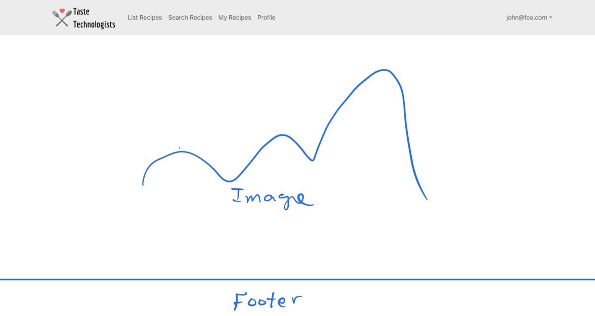
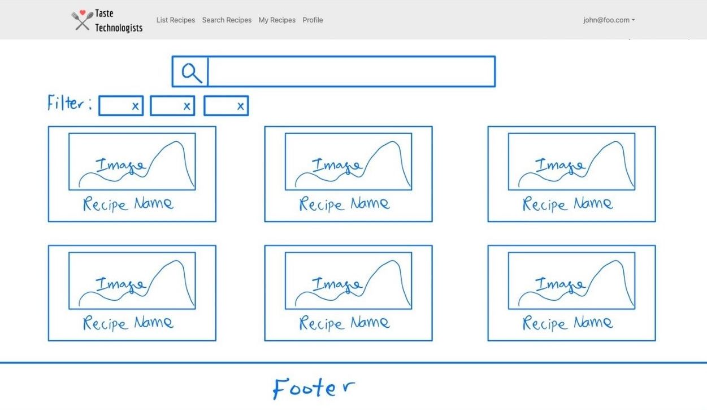

# Taste Technologists

## Table of contents

* [Overview](#overview)
* [Team](#team)
* [Team Contract](#team-contract)
* [User Guide](#user-guide)
* [Developer Guide](#developer-guide)

## Overview

Taste Technologists is a web application designed for college students with limited kitchen resources, minimal cooking skills, and limited access to groceries. Our application is for college students who would like to eat healthier and spend less money on eating out.

Taste Technologists gives students (on-campus or off) a variety of easy and delicious recipes that:
* Can be made using minimal kitchen facilities (at a minimum, a toaster oven).
* Can be made out of ingredients that are available within walking distance of UH.
* Suit local taste sensibilities.
* Can be filtered via dietary restrictions (gluten-free, vegan, etc).
* Have an estimated cost per serving.
* Has an estimated number of servings per recipe.
* Has an estimate of how long it takes to make.

The project illustrates various technologies useful to ICS software engineering students, including:
* [Meteor](https://www.meteor.com/) for Javascript-based implementation of client and server code.
* [React](https://reactjs.org/) for component-based UI implementation and routing.
* [React Bootstrap](https://react-bootstrap.github.io/) CSS Framework for UI design.

It also provides code that implements a variety of useful design concepts, including:

* Vendor, admin and default users (students).  Admins can edit all content in the system, remove inappropriate content and establish users having a vendor role. Vendors can establish a profile including their locations and hours and for each ingredient in the system indicate the stock, cost, and quantity. Regular users can also change ingredient price and availability.  From ingredient information the system can automatically calculate all the places nearby campus that has the ingredient and the prices for each ingredient at each place. 

## Team
Our team consists of five developers: Amanda Achiu, [Iwalani Campbell](https://iwalanicampbell.github.io/), [Christina Mende](https://mendechris.github.io/), [Tsz Ching Wong](https://twong9.github.io/), and [Christianne Young](https://clyyoung.github.io/).

Coordination strategy:
* One meeting in person, one virtually via Discord
* Short meetings on Discord if needed

## Team Contract
In order to efficiently work together as a group, we have come with a [team contract](https://docs.google.com/document/d/1sjqEOUAvMnTnnFC-cFGRXGMhvwe6CVLrR_du6l2pfGI/edit?usp=sharing).

## User Guide

This section provides a walkthrough of the Taste Technologists user interface and its capabilities.

### Landing Page

The landing page is presented to users when they visit the top-level URL to the site.

### Search Recipe Page 

### Individual Recipe Page

### Sign in and sign up

Click on the "Login" button in the upper right corner of the navbar, then select "Sign in" to go to the following page and login. You must have been previously registered with the system to use this option:

Alternatively, you can select "Sign up" to go to the following page and register as a new user:

### Search page

The Search page provides the ability to query the recipe database and display the results in the page. In this case, the query also diplays all of the recipes along with their specified restrictions and preferences. Restrictions and preferences can include:

* Minimal kitchen facilities 
* Dietary restrictions 
* Cost, servings, time
* Available ingredients 

## Developer Guide

As our team implements this application, we will be working according to three milestones.

Milestone 1 is located [here](https://github.com/orgs/taste-technologists/projects/1).

